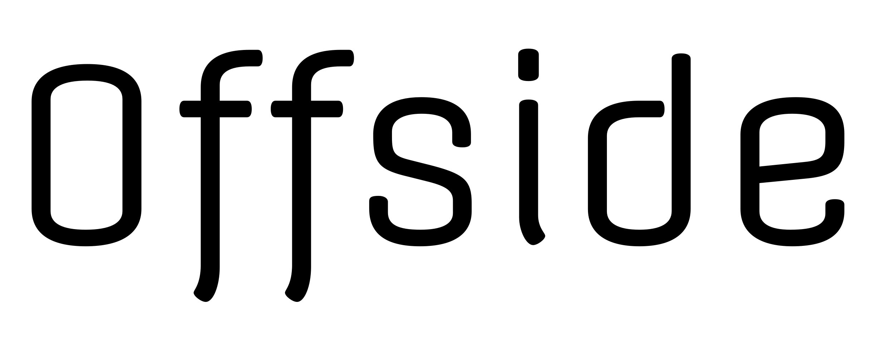
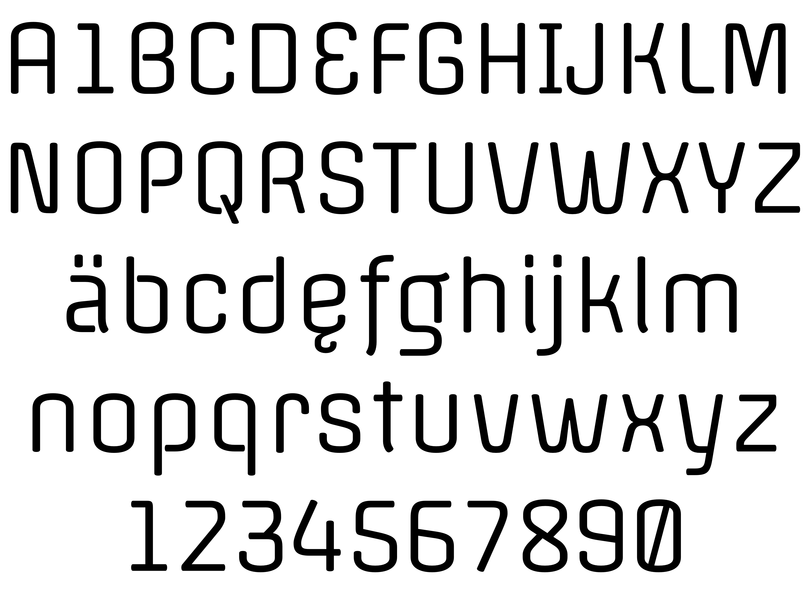

The main feature of Offside is its simple structure and monoline stroke. It is modern, slightly condensed, with large counters to achieve excellent readability on the web, even in small sizes. Its design details make it also suitable for writing headlines or signage with great clarity and prestige.

### Designer

* Eduardo Rodríguez Tunni

### License

Licensed under the [*SIL Open Font License, 1.1*](http://scripts.sil.org/OFL); you may not use this file except in compliance with the License.

To contribute to the project contact Eduardo Rodríguez Tunni > edu@tipo.net.ar
